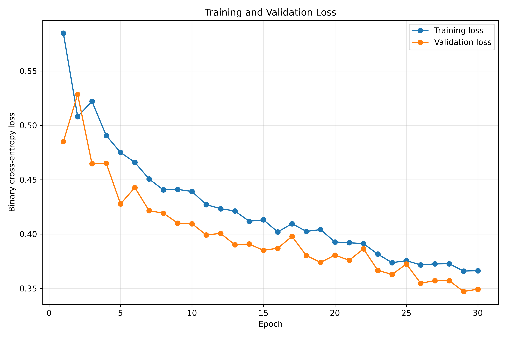
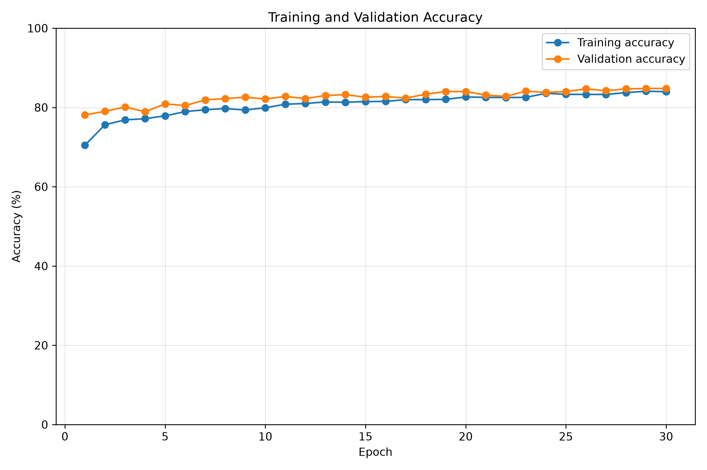
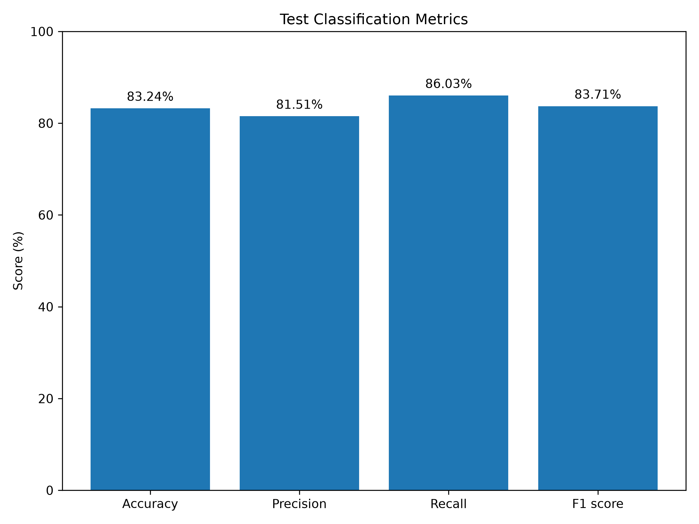
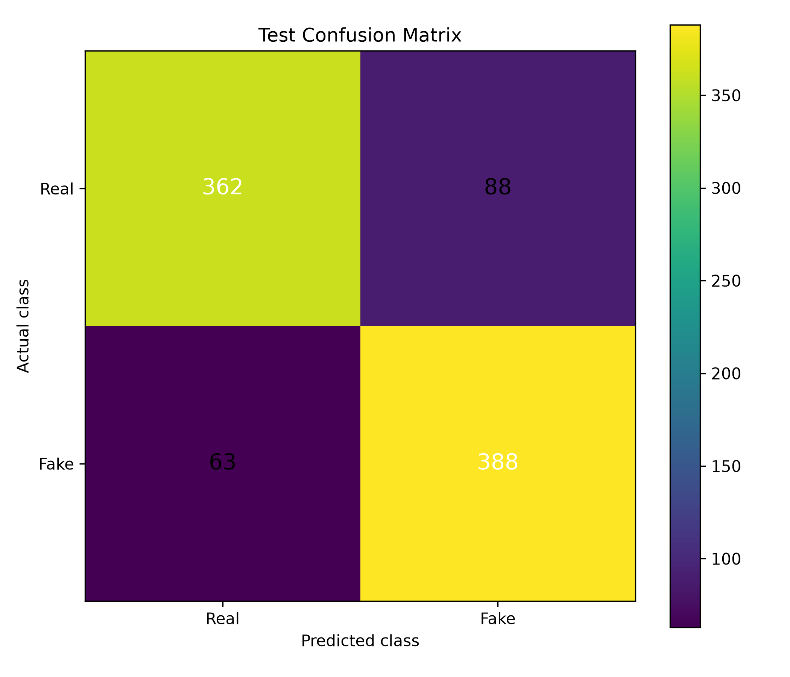

# Audio Deepfake Detection

A deep learning system for classifying speech recordings as **Real** or **AI-generated (Fake)** using PyTorch.

The project extracts acoustic features from audio recordings and combines Convolutional Neural Networks (CNNs) with a Bidirectional Long Short-Term Memory (BiLSTM) network to learn both spectral and temporal speech patterns.

---

# Repository Scope

This repository contains a **scaled implementation** of a complete Audio Deepfake Detection system developed for experimentation and reproducibility.

The local implementation is designed to run efficiently on consumer hardware using a balanced subset of the dataset (6,003 audio samples). The same preprocessing pipeline, feature extraction process, and model architecture were also used to train a **full-scale implementation** on the complete dataset using **Kaggle Notebooks** with GPU acceleration.

---

# Features

- Audio preprocessing
- MFCC feature extraction
- Pitch extraction
- Energy extraction
- CNN feature learning
- Bidirectional LSTM sequence modeling
- Binary classification
- Automatic evaluation metrics
- Training visualization
- Confusion matrix generation

---

# Dataset

The local implementation was trained using a balanced dataset containing:

| Class | Samples |
|------|---------:|
| Real | 3000 |
| Fake | 3003 |
| **Total** | **6003** |

Every audio sample is:

- Converted to mono
- Resampled to **16 kHz**
- Trimmed or padded to **8 seconds**

---

# Extracted Features

The following acoustic features are extracted from every audio recording.

| Feature | Description | Shape |
|----------|-------------|-------|
| MFCC | Spectral representation | 40 × 251 |
| Pitch | Fundamental frequency | 251 |
| Energy | Signal intensity | 251 |

Final dataset tensors:

```text
MFCC   : (6003, 40, 251)
Pitch  : (6003, 251)
Energy : (6003, 251)
```

---

# Project Pipeline

```text
Audio Files
      │
      ▼
Audio Preprocessing
      │
      ▼
Feature Extraction
(MFCC + Pitch + Energy)
      │
      ▼
CNN Feature Learning
      │
      ▼
Bidirectional LSTM
      │
      ▼
Fully Connected Layer
      │
      ▼
Prediction
(Real / Fake)
```

Model size:

**236,225 trainable parameters**

---

# Training Configuration

| Parameter | Value |
|-----------|-------|
| Framework | PyTorch |
| Device | Apple Metal (MPS) |
| Optimizer | AdamW |
| Loss Function | BCEWithLogitsLoss |
| Batch Size | 32 |
| Maximum Epochs | 30 |
| Learning Rate Scheduler | ReduceLROnPlateau |
| Early Stopping | Enabled |

---

# Results

This project includes results from two different implementations.

- **Local Implementation** – trained on a balanced subset of the dataset using Apple Silicon hardware.
- **Full-Scale Implementation** – trained on the complete dataset using Kaggle Notebooks with GPU acceleration.

---

## Local Implementation Results

The local implementation was trained using approximately **6,000 balanced audio samples**.

| Metric | Value |
|---------|------:|
| Accuracy | **83.24%** |
| Precision | **81.51%** |
| Recall | **86.03%** |
| F1 Score | **83.71%** |

---

### Training Loss

The graph below shows the training and validation loss during model training.



---

### Training Accuracy

The graph below shows the training and validation accuracy across all epochs.



---

### Test Classification Metrics

Overall classification performance on the local test dataset.



---

### Confusion Matrix

The confusion matrix summarizes the model predictions on the local test dataset.

```text
                 Predicted

             Real     Fake

Actual Real   362       88

Actual Fake    63      388
```



---

## Full-Scale Implementation Results

The complete implementation was trained on the **entire dataset** using **Kaggle Notebooks** with GPU acceleration and mixed-precision training.

| Configuration | Accuracy | F1 Score |
|---------------|---------:|---------:|
| Base Model (20 MFCCs) | **96.03%** | **95.97%** |
| Enhanced with Data Augmentation | **97.70%** | **97.71%** |
| Optimized Model (40 MFCCs) | **98.26%** | **98.27%** |

The improvement in performance demonstrates the effectiveness of increasing the number of MFCC coefficients and incorporating data augmentation during training.

---

## Performance Comparison

| Implementation | Dataset | Platform | Accuracy |
|---------------|---------|----------|---------:|
| Local Implementation | 6,003 balanced samples | Apple Silicon (MPS) | **83.24%** |
| Full-Scale Implementation | Complete dataset | Kaggle Notebooks (GPU) | **98.26%** |

---

# Project Structure

```text
Audio-Classification/
│
├── Src/
│   ├── Preprocess.py
│   ├── Train.py
│   ├── GenerateResults.py
│
├── data/
│
├── models/
│
├── results/
│   ├── accuracy_graph.png
│   ├── loss_graph.png
│   ├── confusion_matrix.png
│   ├── test_metrics_graph.png
│   ├── evaluation_summary.txt
│   └── training_metrics.json
│
├── Notebooks/
│
├── Requirements.txt
│
├── README.md
│
└── .gitignore
```

---

# Installation

Clone the repository:

```bash
git clone <repository-url>
```

Navigate into the project:

```bash
cd Audio-Classification
```

Create a virtual environment:

```bash
python -m venv .venv
```

Activate the environment.

**macOS / Linux**

```bash
source .venv/bin/activate
```

**Windows**

```bash
.venv\Scripts\activate
```

Install the required packages:

```bash
pip install -r Requirements.txt
```

---

# Running the Project

### 1. Preprocess the dataset

```bash
python Src/Preprocess.py
```

### 2. Train the model

```bash
python Src/Train.py
```

### 3. Generate evaluation graphs and summary

```bash
python Src/GenerateResults.py
```

Generated outputs:

- Training loss graph
- Training accuracy graph
- Test metrics graph
- Confusion matrix
- Evaluation summary
- Training metrics JSON

---

# Future Improvements

Possible extensions include:

- Data augmentation
- Transformer-based speech models
- Self-supervised audio representations
- Cross-dataset evaluation
- Real-time inference
- Model optimization for deployment

---

